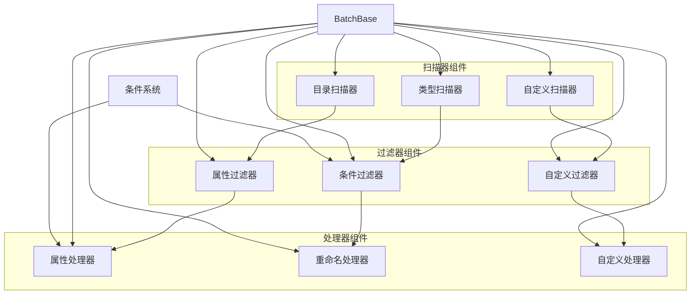

# BatchProcessor - 蓝图资产批处理工具

## 概述

BatchProcessor是一个功能强大的Unreal Engine编辑器插件，专门用于批量处理蓝图资产。该插件采用模块化设计，提供了灵活的扫描、过滤和处理机制，能够高效地对大量蓝图资产进行自动化操作。

## 核心架构

插件采用多组件并行架构设计，支持多个扫描器、过滤器和处理器同时工作：



### 1. UBatchBase - 批处理基类
- **功能**：批处理流程的核心控制器
- **状态管理**：支持Idle、Start、Processing、Stop、Completed五种状态
- **组件管理**：管理多个扫描器、过滤器和处理器数组
- **资产加载**：支持异步资产加载和进度通知

### 2. UScannerBase - 扫描器基类
- **功能**：负责查找和收集需要处理的资产
- **实现**：支持目录扫描等多种扫描策略
- **扩展**：可通过继承UScannerBase实现自定义扫描逻辑

### 3. UFilterBase - 过滤器基类
- **功能**：对扫描到的资产进行初步筛选
- **实现**：支持基于属性条件的过滤策略
- **扩展**：可通过继承UFilterBase实现自定义过滤逻辑

### 4. UProcessorBase - 处理器基类
- **功能**：执行具体的资产修改操作
- **类型**：
  - 条件处理器：基于条件执行处理
  - 属性处理器：修改资产属性
  - 重命名处理器：批量重命名资产
- **扩展**：支持子处理器嵌套，可通过继承UProcessorBase实现自定义处理逻辑

### 5. UConditionBase - 条件系统基类
- **功能**：提供条件判断机制
- **数据类型支持**：
  - Bool：布尔值条件
  - Int：整型条件
  - Float：浮点型条件
  - String：字符串条件
- **操作符**：支持等于、不等于、大于、小于等比较操作

## 详细功能模块

### 1. 扫描器功能模块

#### 1.1 目录扫描器
- **功能**：扫描指定目录下的所有蓝图资产
- **支持**：递归扫描、文件类型过滤、排除目录设置
- **配置项**：
  - 扫描路径设置
  - 文件扩展名过滤
  - 最大扫描深度限制
  - 排除模式设置

#### 1.2 资产类型扫描器
- **功能**：基于资产类型进行扫描
- **支持**：蓝图类、材质、纹理、音频等所有UE资产类型
- **特性**：
  - 类型继承关系支持
  - 接口实现检测
  - 标签系统集成

#### 1.3 自定义扫描器
- **扩展接口**：`UBatchScannerBase`
- **自定义逻辑**：支持用户实现特定的扫描逻辑
- **应用场景**：项目特定的资产组织规则

### 2. 过滤器功能模块

#### 2.1 属性过滤器
- **功能**：基于资产属性进行筛选
- **支持属性类型**：
  - 布尔值：`bIsBlueprint`、`bIsCooked`等
  - 整型：版本号、引用计数等
  - 字符串：资产名称、路径、标签等
  - 枚举：资产状态、类型等

#### 2.2 条件组合过滤器
- **逻辑操作**：AND、OR、NOT组合
- **嵌套支持**：多级条件嵌套
- **优先级管理**：条件执行顺序控制

#### 2.3 自定义过滤器
- **扩展接口**：`UBatchFilterBase`
- **自定义条件**：项目特定的筛选规则
- **性能优化**：支持预编译条件表达式

### 3. 处理器功能模块

#### 3.1 属性修改处理器
- **功能**：批量修改资产属性值
- **支持操作**：
  - 设置属性值
  - 增量修改
  - 条件赋值
  - 表达式计算

#### 3.2 重命名处理器
- **功能**：批量重命名资产
- **命名规则**：
  - 前缀/后缀添加
  - 模式替换
  - 序号生成
  - 正则表达式

#### 3.3 依赖关系处理器
- **功能**：处理资产间的依赖关系
- **操作类型**：
  - 引用更新
  - 依赖修复
  - 循环引用检测
  - 冗余引用清理

#### 3.4 导入/导出处理器
- **功能**：资产数据的导入导出
- **格式支持**：JSON、XML、CSV
- **数据映射**：自定义字段映射规则

### 4. 条件系统功能模块

#### 4.1 基础条件类型
- **布尔条件**：真/假判断
- **数值条件**：等于、大于、小于、范围判断
- **字符串条件**：包含、匹配、正则表达式
- **对象条件**：类型检查、接口实现、继承关系

#### 4.2 复合条件
- **逻辑组合**：与(AND)、或(OR)、非(NOT)
- **条件组**：分组管理复杂条件
- **条件优先级**：执行顺序控制

#### 4.3 自定义条件
- **扩展接口**：`UBatchConditionBase`
- **脚本支持**：蓝图脚本条件
- **外部数据**：数据库、配置文件条件

### 5. 状态管理功能模块

#### 5.1 批处理状态机
- **状态类型**：Idle、Starting、Processing、Paused、Stopped、Completed
- **状态转换**：完整的生命周期管理
- **错误处理**：异常状态恢复

#### 5.2 进度跟踪
- **进度计算**：基于资产数量的百分比计算
- **时间预估**：剩余时间估算
- **详细日志**：每个步骤的执行记录

#### 5.3 结果统计
- **处理统计**：成功/失败/跳过的资产数量
- **性能指标**：处理时间、内存使用
- **错误报告**：详细的错误信息和位置

### 6. 核心功能模块

#### 6.1 基础数据处理
- **属性操作**：支持蓝图属性的读取和修改
- **变量管理**：管理批处理过程中的临时变量
- **便笺簿系统**：提供临时数据存储功能

#### 6.2 条件评估系统
- **基础条件**：支持布尔、数值、字符串等基本条件判断
- **属性比较**：基于资产属性值的条件评估
- **逻辑组合**：支持AND、OR等逻辑操作

#### 6.3 状态跟踪系统
- **处理状态**：实时跟踪批处理进度和状态
- **错误处理**：基础的错误检测和状态恢复
- **结果统计**：统计成功、失败和跳过的资产数量

### 7. 扩展支持模块

#### 7.1 插件架构支持
- **模块化设计**：核心组件分离设计
- **继承扩展**：所有基类支持继承和重写
- **接口定义**：提供基础的扩展接口

#### 7.2 蓝图集成支持
- **蓝图接口**：核心功能提供蓝图可调用接口
- **资产类型支持**：主要针对蓝图资产的批量处理
- **编辑器集成**：与Unreal Editor的无缝集成

#### 7.3 自定义开发支持
- **扩展示例**：提供基础的扩展开发框架
- **接口文档**：详细的接口说明和使用指南
- **调试支持**：基础的日志和调试功能

## 使用流程

### 基本使用流程

1. **配置扫描器**：设置需要扫描的目录或资产类型
2. **设置过滤器**：定义筛选条件，排除不需要处理的资产
3. **配置处理器**：设置具体的处理逻辑和条件
4. **启动批处理**：执行批量操作，监控处理进度
5. **查看结果**：获取处理结果和修改统计

### 详细操作步骤

#### 步骤1：创建批处理任务
```cpp
// 创建批处理实例
UBatchBase* BatchProcessor = NewObject<UBatchBase>();

// 配置基本参数（通过BatchFunctionLibrary）
UBatchFunctionLibrary::SetBatchName(BatchProcessor, TEXT("MyBatchTask"));
UBatchFunctionLibrary::SetBatchDescription(BatchProcessor, TEXT("批量修改蓝图属性"));
```

#### 步骤2：配置扫描器
```cpp
// 创建目录扫描器（需要继承UScannerBase实现）
UMyDirectoryScanner* Scanner = NewObject<UMyDirectoryScanner>();
Scanner->SetScanPath(TEXT("/Game/Blueprints"));
Scanner->SetRecursive(true);

// 添加扫描器到批处理
BatchProcessor->Scanners.Add(Scanner);
```

#### 步骤3：配置过滤器
```cpp
// 创建条件过滤器（需要继承UFilterBase实现）
UMyConditionFilter* Filter = NewObject<UMyConditionFilter>();

// 添加过滤条件（通过BatchFunctionLibrary）
FBatchCondition Condition;
Condition.PropertyName = TEXT("bIsBlueprint");
Condition.Operator = EBatchConditionOperator::Equal;
Condition.Value = true;

UBatchFunctionLibrary::AddConditionToFilter(Filter, Condition);

// 添加过滤器到批处理
BatchProcessor->Filters.Add(Filter);
```

#### 步骤4：配置处理器
```cpp
// 创建属性修改处理器（需要继承UProcessorBase实现）
UMyPropertyProcessor* Processor = NewObject<UMyPropertyProcessor>();

// 配置属性修改规则
FBatchPropertyModification Rule;
Rule.PropertyName = TEXT("DefaultValue");
Rule.NewValue = TEXT("NewDefaultValue");
Rule.Condition = nullptr; // 无条件修改

UBatchFunctionLibrary::AddModificationRule(Processor, Rule);

// 添加处理器到批处理
BatchProcessor->Processors.Add(Processor);
```

#### 步骤5：执行批处理
```cpp
// 启动批处理
BatchProcessor->StartBatch();

// 监听进度事件（通过BatchFunctionLibrary）
UBatchFunctionLibrary::OnProgressUpdated(BatchProcessor).AddLambda([](float Progress, const FString& Status) {
    UE_LOG(LogBatchProcessor, Log, TEXT("进度: %.1f%%, 状态: %s"), Progress * 100, *Status);
});

// 监听完成事件
UBatchFunctionLibrary::OnBatchCompleted(BatchProcessor).AddLambda([](const FBatchResult& Result) {
    UE_LOG(LogBatchProcessor, Log, TEXT("批处理完成: 成功%d, 失败%d, 跳过%d"), 
        Result.SuccessCount, Result.FailedCount, Result.SkippedCount);
});
```

## 功能实现细节

### 核心算法实现

#### 1. 资产扫描算法
```cpp
// 异步扫描实现
void UBatchDirectoryScanner::ScanAssetsAsync()
{
    // 使用UE4的异步任务系统
    AsyncTask(ENamedThreads::GameThread, [this]() {
        TArray<FAssetData> AssetDataList;
        
        // 递归扫描目录
        FAssetRegistryModule& AssetRegistryModule = FModuleManager::LoadModuleChecked<FAssetRegistryModule>("AssetRegistry");
        AssetRegistryModule.Get().GetAssetsByPath(ScanPath, AssetDataList, true);
        
        // 过滤文件类型
        AssetDataList = AssetDataList.FilterByPredicate([this](const FAssetData& AssetData) {
            return FileExtensions.Contains(AssetData.AssetClass.ToString());
        });
        
        OnScanCompleted.Broadcast(AssetDataList);
    });
}
```

#### 2. 条件评估引擎
```cpp
// 条件表达式解析
bool UBatchConditionEvaluator::EvaluateCondition(const FBatchCondition& Condition, UObject* TargetObject)
{
    // 获取属性值
    FProperty* Property = FindFProperty<FProperty>(TargetObject->GetClass(), *Condition.PropertyName);
    if (!Property) return false;
    
    // 根据操作符进行评估
    switch (Condition.Operator)
    {
    case EBatchConditionOperator::Equal:
        return ComparePropertiesEqual(Property, TargetObject, Condition.Value);
    case EBatchConditionOperator::NotEqual:
        return !ComparePropertiesEqual(Property, TargetObject, Condition.Value);
    case EBatchConditionOperator::GreaterThan:
        return ComparePropertiesGreater(Property, TargetObject, Condition.Value);
    // ... 其他操作符实现
    }
    
    return false;
}
```

#### 3. 批量处理优化
```cpp
// 批量处理队列管理
void UBatchProcessor::ProcessAssetsInBatches(const TArray<UObject*>& Assets)
{
    const int32 BatchSize = 10; // 每批处理10个资产
    
    for (int32 i = 0; i < Assets.Num(); i += BatchSize)
    {
        // 创建批处理任务
        int32 EndIndex = FMath::Min(i + BatchSize, Assets.Num());
        TArray<UObject*> BatchAssets(Assets.GetData() + i, EndIndex - i);
        
        // 异步处理批次
        ProcessBatchAsync(BatchAssets, i, Assets.Num());
        
        // 控制处理速度，避免资源竞争
        FPlatformProcess::Sleep(0.1f);
    }
}
```

### 性能优化策略

#### 1. 内存管理
- **懒加载**：资产按需加载，减少内存占用
- **对象池**：重用处理器实例，减少创建开销
- **缓存机制**：条件评估结果缓存，避免重复计算

#### 2. 并发处理
- **异步任务**：使用UE4的异步任务系统
- **线程安全**：确保多线程环境下的数据安全
- **资源锁**：合理使用读写锁，避免死锁

#### 3. 错误恢复
- **事务处理**：支持操作回滚
- **断点续传**：支持从失败点继续处理
- **错误隔离**：单个资产失败不影响整体流程

## 技术实现

### 核心数据结构
- `FBatchProperty`：批处理属性，包含变量地址和属性结构
- `FBatchVariable`：批处理变量，包含变量地址和结构信息
- `UBatchScratchPad`：批处理便笺簿，用于临时数据存储

### 接口设计
- `IBatchScratchPadInterface`：便笺簿接口，支持UID获取和类信息
- `UBatchFunctionLibrary`：功能库，提供静态工具函数

### 扩展支持
- 插件支持BatchProcessorExtend模块，可进行功能扩展
- 所有核心组件都设计为可继承和重写

## 实际应用案例

### 案例1：批量重命名蓝图资产

**场景**：项目中有大量蓝图需要按照新的命名规范重命名

**配置步骤**：
1. 使用目录扫描器扫描 `/Game/Characters/Blueprints`
2. 设置过滤器：只处理以"BP_"开名的蓝图
3. 配置重命名处理器：
   - 移除"Old_"前缀
   - 添加"New_"前缀
   - 使用驼峰命名法
4. 执行批处理，监控重命名进度

**效果**：一次性完成500+个蓝图的重命名，命名规范统一

### 案例2：批量修改材质参数

**场景**：需要批量修改所有材质的粗糙度参数

**配置步骤**：
1. 使用资产类型扫描器扫描所有材质资产
2. 设置过滤器：排除已烘焙的材质
3. 配置属性修改处理器：
   - 属性名：`Roughness`
   - 新值：`0.3`
   - 条件：当前值大于0.5的材质
4. 执行批处理，自动更新材质参数

**效果**：快速统一材质外观，提升视觉一致性

### 案例3：项目版本迁移

**场景**：从UE4迁移到UE5，需要批量更新资产引用

**配置步骤**：
1. 扫描整个项目目录
2. 设置过滤器：处理所有包含旧引用的资产
3. 配置引用更新处理器：
   - 检测旧版本引用路径
   - 自动转换为新版本路径
   - 创建引用映射表
4. 执行批处理，自动修复引用关系

**效果**：大大减少手动迁移工作量，避免引用错误

## 最佳实践指南

### 1. 性能优化建议

#### 扫描优化
- **路径选择**：尽量缩小扫描范围，避免全项目扫描
- **文件过滤**：使用精确的文件扩展名过滤
- **递归控制**：合理设置递归深度，避免过度扫描

#### 处理优化
- **批处理大小**：根据内存情况调整批处理大小（建议10-50个资产）
- **异步处理**：启用异步处理避免编辑器卡顿
- **进度保存**：大型任务启用进度保存功能

#### 内存管理
- **资产卸载**：处理完成后及时卸载不再需要的资产
- **缓存清理**：定期清理条件评估缓存
- **资源监控**：监控内存使用，避免内存泄漏

### 2. 错误处理策略

#### 预防措施
- **备份机制**：重要操作前自动创建资产备份
- **验证检查**：处理前验证条件和参数的合法性
- **权限检查**：检查文件读写权限，避免权限错误

#### 恢复策略
- **事务回滚**：支持操作失败时的自动回滚
- **断点续传**：支持从失败点继续处理
- **错误报告**：生成详细的错误报告和修复建议

### 3. 扩展开发指南

#### 自定义扫描器开发
```cpp
// 继承基类实现自定义扫描逻辑
UCLASS()
class UMyCustomScanner : public UBatchScannerBase
{
    GENERATED_BODY()
    
public:
    virtual void ScanAssets() override
    {
        // 实现自定义扫描逻辑
        // 调用OnScanCompleted广播结果
    }
};
```

#### 自定义处理器开发
```cpp
// 继承基类实现自定义处理逻辑
UCLASS()
class UMyCustomProcessor : public UBatchProcessorBase
{
    GENERATED_BODY()
    
public:
    virtual void ProcessAsset(UObject* Asset) override
    {
        // 实现自定义处理逻辑
        // 调用OnAssetProcessed广播进度
    }
};
```

#### 自定义条件开发
```cpp
// 继承基类实现自定义条件
UCLASS()
class UMyCustomCondition : public UBatchConditionBase
{
    GENERATED_BODY()
    
public:
    virtual bool Evaluate(UObject* TargetObject) override
    {
        // 实现自定义条件评估逻辑
        return true; // 返回评估结果
    }
};
```

### 4. 调试和测试

#### 调试工具使用
- **日志系统**：启用详细日志记录处理过程
- **断点调试**：在关键处理步骤设置断点
- **性能分析**：使用UE4的性能分析工具监控性能

#### 测试策略
- **单元测试**：为每个组件编写单元测试
- **集成测试**：测试完整的批处理流程
- **压力测试**：测试大规模资产处理的稳定性

### 5. 部署和维护

#### 生产环境部署
- **版本控制**：使用版本控制系统管理配置模板
- **权限管理**：设置合适的操作权限
- **监控告警**：设置处理异常的监控告警

#### 日常维护
- **配置备份**：定期备份重要配置
- **日志清理**：定期清理处理日志
- **性能优化**：根据使用情况持续优化性能

## 优势特点总结

### 技术优势
- **模块化架构**：清晰的组件分离设计，便于理解和扩展
- **基础功能完善**：提供扫描、过滤、处理的核心功能框架
- **Unreal集成**：深度集成Unreal Engine编辑器环境
- **蓝图支持**：提供基础的蓝图接口，便于非程序员使用

### 使用优势
- **批量处理能力**：支持对蓝图资产进行批量操作
- **条件系统**：提供基础的属性条件判断功能
- **状态跟踪**：实时监控处理进度和状态
- **扩展性**：支持通过继承基类实现自定义功能

### 实际价值
- **效率提升**：减少重复性手工操作时间
- **一致性保证**：确保批量修改的一致性和正确性
- **开发友好**：为技术团队提供可扩展的批处理框架
- **项目规范**：促进项目资产管理的标准化

BatchProcessor插件为Unreal Engine开发提供了基础的蓝图资产批量处理框架，是技术团队进行资产自动化管理的实用工具。通过合理使用该插件，可以有效提升开发效率，保证资产修改质量，并为项目提供可扩展的批处理解决方案。