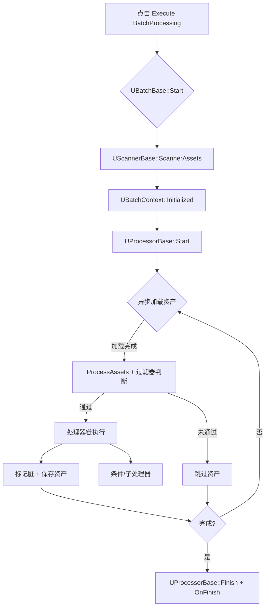

# BatchProcessor - 蓝图资产批处理工具

## 目录

- [插件概览](#插件概览)
- [核心概念与架构](#核心概念与架构)
- [执行流程](#执行流程)
- [内置组件清单](#内置组件清单)
- [快速开始](#快速开始)
- [编辑器集成](#编辑器集成)
- [扩展开发指南](#扩展开发指南)
- [常见问题](#常见问题)

## 插件概览

BatchProcessor 是一个专为 **Unreal Engine 编辑器** 编写的蓝图批处理插件。通过组合扫描器（Scanner）、过滤器（Filter）、处理器（Processor）和条件（Condition），你可以在保留可视化体验的同时定制复杂的资产批处理规则。插件在 `UBatchBase` 基类中实现了完整的调度链路，并在蓝图编辑器工具栏提供了一键执行/终止按钮。

> **目标场景**：批量修改蓝图默认值、统一资源引用、批量生成辅助数据、批量执行校验等。

## 核心概念与架构

### 顶层对象

- **`UBatchBase`**：批处理任务蓝图的父类，负责生命周期、扫描触发、加载调度、进度 UI 与处理器执行。
- **`UBatchContext`**：在一次批处理中共享的上下文，保存待处理资产集合、异步加载状态、统计信息以及 ScratchPad。
- **`UBatchScratchPad` / `IBatchScratchPadInterface`**：供处理器或条件跨资产缓存临时状态。

### 模块化组件

- **`UScannerBase`**
  - `ScannerAssets` -> `OnScannerAssets` 收集 `FAssetData`，随后 `OnFilter` 根据正则表达式与名称类型 (`EFilter_NameType`) 做初筛。
- **`UFilterBase`**
  - `Filter` -> `OnFilter`，返回 `true` 表示命中过滤器（默认 `false`）。若任一过滤器返回 `true`，该资产被排除。
- **`UProcessorBase`**
  - `Start / Processing / Finish` 对应生命周期，`OnProcessing` 中实现逻辑。可返回 `true` 表示资产被修改以触发保存。
  - 可通过 `GetSubProcessors` 组合子处理器，或使用 `UBatchFunctionLibrary::DoProcessors` 顺序执行数组。
- **`UConditionBase`**
  - `CheckCondition` 决定条件是否通过，常和 `UProcessor_Condition` 配合控制流程。

### 数据结构

- **`FBatchVariable`**：封装任意对象或属性的地址/结构体，传递给处理器/条件用于读写。
- **`FBatchProperty`**：描述某个 `FProperty` 的内存地址，通常由 `UBatchFunctionLibrary::FindProperty` 返回。

## 执行流程



- 进度通过 `SNotificationItem` 实时展示。
- 资产保存逻辑在 `UBatchBase::OnAssetLoaded` 中完成，自动关闭编辑器并调用 `UPackage::SavePackage`。

## 内置组件清单

| 类型 | 类名 | 功能要点 |
| --- | --- | --- |
| Scanner | `UScanner_Directory` | 扫描指定目录，支持递归 |
| Filter | `UFilter_GeneratedClass` | 根据 `GeneratedClass` 类型过滤 |
| Processor | `UProcessor_Condition` | 条件分支执行 |
| Processor | `UProcessor_Iterators` | 对数组、集合等执行迭代 |
| Processor | `UProcessor_Usage` | 统计/调试用途 |
| ProcessorProperty | `UProcessorProperty_*` | 修改 Bool/Int/Float/String/Material 等属性 |
| Condition | `UConditionProperty_*` | 针对 Bool/Int/Float/String/Class 等属性判定 |

## 快速开始

### 1. 创建批处理蓝图

1. 在内容浏览器新建蓝图类，父类选 `BatchBase`。
2. 进入 **Class Defaults**，在 `Scanners / Filters / Processors` 中添加需要的实例并配置参数。

### 2. 配置示例

```text
Scanners:
  - Scanner_Directory: Directory=/Game/MyBlueprints, bRecursivePaths=true
Filters:
  - Filter_GeneratedClass: TargetClass=BP_BaseActor_C
Processors:
  - Processor_Condition
      Conditions: [ConditionProperty_Bool(bMustPassAllCondition=true)]
      TrueProcessors: [ProcessorProperty_Bool(PropertyPath="bReplicates", Value=true)]
```

### 3. 运行与监控

1. 保持批处理蓝图编辑器打开。
2. 工具栏中点击 **执行批处理**（Play 图标）。
3. 在右下角通知面板查看进度与当前资产。
4. 可随时点击 **终止批处理**（Stop 图标）停止任务。

## 编辑器集成

`FBatchProcessorModule` 在启动时注册蓝图编辑器工具栏扩展：

- `ExecuteBatchProcessing`：调用 `UBatchBase::Start()`。
- `TerminationBatchProcessing`：调用 `UBatchBase::Stop()`。

按钮仅在当前蓝图的 `GeneratedClass` 继承自 `UBatchBase` 时显示。

## 扩展开发指南

1. **自定义扫描器**
   - 继承 `UScannerBase`，重写 `OnScannerAssets` 收集资产，可复用 `OnFilter` 的正则过滤。
2. **自定义过滤器**
   - 继承 `UFilterBase`，在 `OnFilter` 中返回是否命中筛选条件。
3. **自定义处理器**
   - 继承 `UProcessorBase`，重写 `OnProcessing` 并使用 `UBatchFunctionLibrary::FindProperty / SetProperty` 操作默认值。
   - 如需跨资产共享数据，实现 `IBatchScratchPadInterface` 并在 `GetScratchPad` 中取得自定义 ScratchPad。
4. **条件扩展**
   - 继承 `UConditionBase`，封装更复杂的布尔判断，在处理器或条件树中复用。

建议在 C++ 中实现核心逻辑，蓝图中组合参数，以保持性能与可视化并存。

## 常见问题

- **如何只处理部分资产？**
  - 使用 `UScanner_Directory` 指定路径，并在 `RegularExpressions` 中写入正则表达式过滤资产/包名。
- **资产未保存怎么办？**
  - 检查 `UProcessorBase::OnProcessing` 是否返回 `true`，只有返回 `true` 时 `UBatchBase` 才会保存资产。
- **如何自定义进度显示？**
  - 可在 `UBatchBase` 的子类中重写 `OnProcessing` 或 `OnFinish`，接入自定义 UI。
- **为什么过滤器总是排除所有资产？**
  - 请确认 `UFilterBase::Filter` 返回 `true` 表示“命中过滤器（需要排除）”，若希望资产通过，请返回 `false`。

---

如需了解更多 API 细节，请参考 `Source/BatchProcessor/Public` 目录中的头文件。