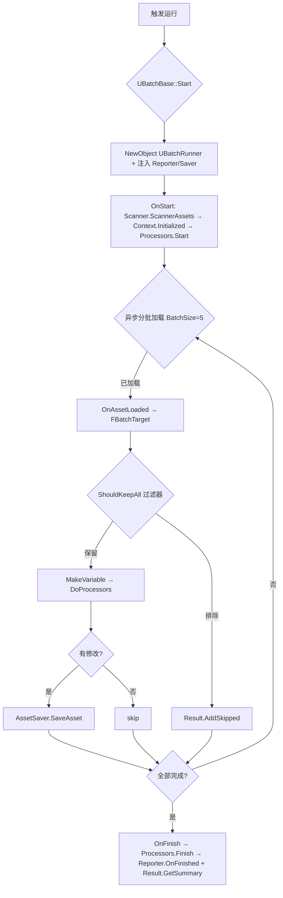

# BatchProcessor — 资产批处理工具

## 目录

- [插件概览](#插件概览)
- [两种配置方式](#两种配置方式)
- [核心架构](#核心架构)
- [执行流程](#执行流程)
- [内置组件清单](#内置组件清单)
- [快速开始：UBatchAsset（推荐）](#快速开始ubatchasset推荐)
- [快速开始：蓝图方式（兼容旧流程）](#快速开始蓝图方式兼容旧流程)
- [定制编辑器功能](#定制编辑器功能)
- [扩展开发指南](#扩展开发指南)
- [试运行（Dry-run）](#试运行dry-run)
- [CI / 命令行集成](#ci--命令行集成)
- [常见问题](#常见问题)

---

## 插件概览

BatchProcessor 是专为 **Unreal Engine 编辑器** 设计的资产批处理插件。通过组合扫描器（Scanner）、过滤器（Filter）、处理器（Processor）和条件（Condition），可以批量修改资产默认值、统一资源引用、批量校验、批量生成辅助数据。

**五层分层架构（从上到下）**：

```
配置层   UBatchBase / UBatchAsset  — 不可变数据模板
编排层   UBatchRunner              — 状态机 / StreamableManager / 全流程
服务层   IBatchProgressReporter / IBatchAssetSaver  — 可注入的 UI 与 IO 实现
组件层   Scanner / Filter / Processor / Condition   — 可组合业务逻辑
内核层   UBatchFunctionLibrary     — 反射读写引擎
```

> 支持蓝图（Blueprint）、数据资产（DataAsset）、材质（Material）等任意 `UObject` 派生类型。

---

## 两种配置方式

| | UBatchAsset（推荐） | 蓝图子类（兼容旧流程） |
|---|---|---|
| 创建方式 | Content Browser → 右键 → **批处理任务** | 新建蓝图，父类选 `BatchBase` |
| 编辑界面 | 专属多 Tab 定制编辑器 | 蓝图 Class Defaults |
| 流水线可视化 | ✔ 增删 / 排序 / 校验图标 | ✗ 仅属性列表 |
| 运行控制台 | ✔ 进度条 / 实时计数 / 试运行 | ✗ 仅蓝图工具栏按钮 |
| 预览候选资产 | ✔ pre-load 扫描零副作用 | ✗ |
| 结果日志 | ✔ TouchedAssets / 校验横幅 | ✗ 通知气泡 |
| 蓝图事件扩展 | ✗ | ✔ Event Graph 可重写 |
| 并存过渡 | ✔ `UBatchAsset` 继承 `UBatchBase`，运行层零侵入 | ✔ |

两种方式**运行时完全一致**：均走 `UBatchRunner` 的五层架构。

---

## 核心架构

### 顶层对象

- **`UBatchBase`**：配置模板基类，持有 `Scanners / Filters / Processors` 内联实例与 `bDryRun` 开关。`Start()` 创建运行实例，自身不承载任何运行态。
- **`UBatchAsset`**：`UBatchBase` 的具体子类，以 `.uasset` 文件存储配置，双击打开定制编辑器。比蓝图子类更轻量、更便于版本管理。
- **`UBatchRunner`**：单次批处理的运行实例（`NewObject` 创建）。承载状态机、异步加载器、上下文，编排全流程。
- **`UBatchContext`**：共享上下文，保存待处理资产集合、统计信息、ScratchPad 映射与 `FBatchResult`。
- **`FBatchTarget`**：统一批处理对象抽象。蓝图取 `GeneratedClass` CDO，其它资产取对象本身。组件链统一面向 `FBatchTarget`。
- **`FBatchResult`**：结果聚合，记录 `ProcessedCount / ModifiedCount / SkippedCount / FailedCount / TouchedAssets`。

### 服务接口（依赖注入）

| 接口 | 编辑器默认实现 | CI / 命令行 | 编辑器控制台 |
|---|---|---|---|
| `IBatchProgressReporter` | `FSlateBatchProgressReporter`（通知气泡） | `FNullBatchProgressReporter` | `FEditorBatchProgressReporter` |
| `IBatchAssetSaver` | `FDefaultBatchAssetSaver`（标脏 + 落盘） | 自定义实现 | `FDryRunBatchAssetSaver`（试运行） |

通过 `UBatchRunner::SetProgressReporter / SetAssetSaver` 注入，或使用 `UBatchBase::StartWithReporter(Reporter, bForceDryRun)` 一步完成。

---

## 执行流程


```mermaid
graph TD
    A[触发运行] --> B{UBatchBase::Start}
    B --> C[NewObject UBatchRunner + 注入 Reporter/Saver]
    C --> D[OnStart: Scanner.ScannerAssets → Context.Initialized → Processors.Start]
    D --> E{异步分批加载 BatchSize=5}
    E -->|已加载| F[OnAssetLoaded → FBatchTarget]
    F --> G{ShouldKeepAll 过滤器}
    G -->|保留| H[MakeVariable → DoProcessors]
    H --> I{有修改?}
    I -->|是| J[AssetSaver.SaveAsset]
    I -->|否| K[skip]
    G -->|排除| L[Result.AddSkipped]
    J --> M{全部完成?}
    K --> M
    L --> M
    M -->|否| E
    M -->|是| N[OnFinish → Processors.Finish → Reporter.OnFinished + Result.GetSummary]
```

- 过滤分两层：**pre-load**（Scanner，基于 `FAssetData`）和 **post-load**（FilterBase，基于已加载 `FBatchTarget`）。
- 停止请求（`RequestStop`）在批次边界生效，`FinalizeProcessors` 保证处理器 `Finish` 生命周期对称。

---

## 内置组件清单

| 类型 | 类名 | 功能要点 |
|---|---|---|
| Scanner | `UScanner_Directory` | 扫描目录（支持递归），按资产类过滤；`ValidateConfig` 检查路径配置 |
| Filter | `UFilter_GeneratedClass` | 按生成类类型过滤，支持 `bInvert` 取反；未配置/未加载时**安全排除全部资产** |
| Processor | `UProcessor_Condition` | 条件分支执行（Conditions + Processors） |
| Processor | `UProcessor_Iterators` | 对数组 / 集合 / 映射迭代 |
| Processor | `UProcessor_Usage` | 结束时弹窗汇总 `FBatchResult` |
| Processor | `UProcessorBlueprintBase` | 蓝图可继承的处理器基类 |
| ProcessorProperty | `UProcessorProperty_Bool/Int/Float/String/Material` | 修改对应类型属性 |
| ProcessorProperty | `UProcessorProperty_Object` | 修改 `UObject` 硬引用属性 |
| ProcessorProperty | `UProcessorProperty_SoftObject` | 修改 `FSoftObjectPath` 软引用属性 |
| Condition | `UConditionProperty_Bool/Class/Int/Float/String` | 属性条件判定；Class 未配置时**安全不匹配** |
| Condition | `UConditionPropertyContainer_Bool/Int/Float/String` | 容器属性条件（含多重集语义） |

**组件 ValidateConfig**：所有组件基类暴露可选虚函数 `virtual void ValidateConfig(TArray<FText>& OutErrors) const {}`，编辑器在流水线视图与结果面板自动聚合调用并展示警告横幅，不影响运行路径。

---

## 快速开始：UBatchAsset（推荐）

### 1. 新建批处理任务

Content Browser → 右键 → **其他 → 批处理任务**，填写名称后双击打开定制编辑器。

### 2. 配置流水线

在左侧 **流水线** 面板：

1. 点击「扫描器」区域的 **＋** 下拉菜单，选择 `Scanner_Directory`，配置目录与资产类。
2. 点击「过滤器」区域的 **＋**，选择 `Filter_GeneratedClass`，配置目标父类。
3. 点击「处理器」区域的 **＋**，选择目标处理器并在中间 **属性** 面板配置参数。

配置有误时，流水线行会显示 ⚠ 图标，**结果** Tab 顶部会出现黄色校验横幅。

### 3. 预览候选资产

点击工具栏 **预览资产**（🔍），或切换到 **预览** Tab 后点击「扫描预览」。  
这只执行 pre-load 扫描链路，**不加载资产内容**，零副作用。

### 4. 运行批处理

| 操作 | 效果 |
|---|---|
| **▶ 运行** | 正式执行，修改结果落盘 |
| **◎ 试运行** | 执行全流程，不落盘；结果显示在 **结果** Tab |
| **■ 停止** | 在当前批次边界停止 |

**控制台** Tab 实时显示进度条、当前资产路径与 `Processed / Modified / Skipped / Failed` 计数。  
**结果** Tab 在运行结束后显示完整的 `TouchedAssets` 列表与最终摘要。

---

## 快速开始：蓝图方式（兼容旧流程）

1. Content Browser → 新建蓝图类，父类选 **BatchBase**。
2. 打开蓝图，进入 **Class Defaults**，在 `Scanners / Filters / Processors` 中添加并配置组件实例。
3. 保持蓝图编辑器打开，工具栏点击 **执行批处理**（Play 图标）。
4. 右下角通知面板查看进度；点击 **终止批处理**（Stop 图标）可随时停止。

---

## 定制编辑器功能

`BatchProcessorEditor` 模块为 `UBatchAsset` 资产提供多 Tab 定制编辑器（`FBatchAssetEditorToolkit`）：

### Tab 说明

| Tab | 说明 |
|---|---|
| **流水线** | 以三个分段列表（Scanner / Filter / Processor）展示组件。下拉 ＋ 添加、✕ 删除，全程支持 Ctrl+Z 撤销。选中行后右侧属性面板同步更新。 |
| **属性** | 标准 `IDetailsView`，展示选中组件或资产整体的属性，直接编辑可立即生效。 |
| **控制台** | 进度条 + 状态标签 + 实时计数器，以 ~10 Hz 轮询刷新（`RegisterActiveTimer`）。运行结束时触发结果面板刷新。 |
| **预览** | 调用 `UBatchRunner::PreviewMatchedAssets`，列出所有 Scanner 候选资产（仅含资产名、类型、路径，不加载内容）。双击在 Content Browser 中同步选中。 |
| **结果** | 顶部展示所有组件 `ValidateConfig` 汇总的校验警告横幅；下方展示上次批处理的摘要与 TouchedAssets 滚动列表。 |
| **差异** | P3 占位（计划展示 Dry-run 属性改变前后对比）。 |

### 工具栏按钮

```
[ ▶ 运行 ]  [ ◎ 试运行 ]  [ ■ 停止 ]  |  [ 🔍 预览资产 ]
```

### 数据流

```
工具栏「运行」
  → Asset.StartWithReporter(FEditorBatchProgressReporter)
    → UBatchRunner（复用五层架构）
      → FEditorBatchProgressReporter.OnProgress → SBatchConsole 刷新
      → UBatchRunner.OnFinished → SBatchConsole 检测边界 → SBatchResultLog.SetResult
```

---

## 扩展开发指南

### pre-load vs post-load 过滤时机

| 阶段 | 写在哪里 | 可用数据 | 典型用途 |
|---|---|---|---|
| **pre-load** | `UScannerBase::OnScannerAssets` 或 `FilterAssetsByName` | `FAssetData`（无资产内容） | 按目录、类名、名称正则筛选，尽早剪枝 |
| **post-load** | `UFilterBase::OnShouldKeep` | 已加载的 `FBatchTarget` | 按属性值、引用关系精细过滤 |

能在 pre-load 阶段判断的条件尽量写在 Scanner，减少异步加载量。

### 新建组件（C++）

```cpp
// 1. 自定义 Scanner
UCLASS(meta=(DisplayName="我的扫描器"))
class UMyScanner : public UScannerBase
{
    GENERATED_BODY()
    virtual void OnScannerAssets(TSet<FAssetData>& Assets) const override;
    virtual void ValidateConfig(TArray<FText>& OutErrors) const override;  // 可选
};

// 2. 自定义 Filter
UCLASS(meta=(DisplayName="我的过滤器"))
class UMyFilter : public UFilterBase
{
    GENERATED_BODY()
    virtual bool OnShouldKeep(const FBatchTarget& Target) const override;
    // 返回 true = 保留；OnShouldKeep 只表达"是否匹配保留条件"，bInvert 由基类处理
};

// 3. 自定义 Processor
UCLASS(meta=(DisplayName="我的处理器"))
class UMyProcessor : public UProcessorBase
{
    GENERATED_BODY()
    virtual bool OnProcessing(const FBatchTarget& Target,
                              UBatchContext* Context,
                              const FBatchVariable& Variable) const override;
    // 返回 true 表示资产被修改，触发保存
};

// 4. 自定义 Condition
UCLASS(meta=(DisplayName="我的条件"))
class UMyCondition : public UConditionBase
{
    GENERATED_BODY()
    virtual bool OnCheckCondition(const FBatchTarget& Target,
                                  UBatchContext* Context,
                                  const FBatchVariable& Variable) override;
    // bNegation 取反由基类处理
};
```

### 自定义进度 / 保存策略

```cpp
// 自定义进度 Reporter（用于 CI 等场景）
class FMyReporter : public IBatchProgressReporter
{
public:
    virtual void OnBegin() override { /* 初始化 */ }
    virtual void OnProgress(const FString& Message) override { /* 上报日志 */ }
    virtual void OnFinished(bool bSuccess, const FString& Message) override { /* 记录结果 */ }
};

// 注入运行
Asset->StartWithReporter(MakeShared<FMyReporter>());

// 或直接用 Runner 注入（蓝图任务兼容路径）
Runner->SetProgressReporter(MakeShared<FMyReporter>());
Runner->SetAssetSaver(MakeShared<FDryRunBatchAssetSaver>());
Runner->Run(Config);
```

### 跨资产共享数据（ScratchPad）

```cpp
// 声明 ScratchPad（派生自 UBatchScratchPad）
UCLASS()
class UMyPad : public UBatchScratchPad
{
    GENERATED_BODY()
public:
    int32 TotalCount = 0;
};

// 在 OnProcessing 中读写
virtual bool OnProcessing(...) const override
{
    UMyPad* Pad = Context->GetScratchPad<UMyPad>(this);
    ++Pad->TotalCount;
    return false;
}
```

### ValidateConfig 实现（为编辑器校验横幅提供反馈）

```cpp
virtual void ValidateConfig(TArray<FText>& OutErrors) const override
{
    if (TargetClass.IsNull())
    {
        OutErrors.Add(FText::FromString(TEXT("TargetClass 未配置，运行时将无效")));
    }
}
```

---

## 试运行（Dry-run）

两种触发方式：

1. **编辑器工具栏**：点击 **◎ 试运行**，强制覆盖 `bDryRun` 设置。
2. **属性开关**：在流水线详情面板或 Class Defaults 中启用 `bDryRun(不保存)`，之后点「运行」也不落盘。

试运行时注入 `FDryRunBatchAssetSaver`：处理器照常执行并返回修改结果，但**不标脏、不关闭编辑器、不 SavePackage**，仅记录「Would Save [资产名]」。`FBatchResult` 仍正常统计，可在 **结果** Tab 查看影响范围。

---

## CI / 命令行集成

```cpp
// CI 场景：无 UI + 自定义保存策略
TObjectPtr<UBatchAsset> Asset = LoadObject<UBatchAsset>(nullptr, TEXT("/Game/Batch/MyBatch"));
if (Asset)
{
    UBatchRunner* Runner = NewObject<UBatchRunner>();
    Runner->SetProgressReporter(MakeShared<FNullBatchProgressReporter>());
    Runner->SetAssetSaver(MakeShared<FMySourceControlSaver>());  // 自定义：先 checkout 再保存
    Runner->Run(Asset);
}
```

也可直接使用 `UBatchBase::StartWithReporter(Reporter)` 简化调用，Runner 生命周期由 `UBatchBase` 管理。

---

## 常见问题

**Q：如何只处理部分资产？**
使用 `Scanner_Directory` 指定路径，`RegularExpressions` 写正则表达式；或叠加 `Filter_GeneratedClass` 限定类型。

**Q：资产未保存怎么办？**
检查 `OnProcessing` 是否返回 `true`；确认未启用 `bDryRun`；查看 **结果** Tab 或通知气泡中的失败计数。

**Q：过滤器的安全默认行为是什么？**
`UFilter_GeneratedClass` / `UConditionProperty_Class` 若目标类**未配置**或**尚未加载**，无论 `bInvert` 取何值，一律**排除全部资产**并输出 Warning，防止漏配静默放行。流水线视图的 ⚠ 图标与结果 Tab 校验横幅会提前提示。

**Q：容器条件 Include / Included / Equal 的语义？**
- `Include`：配置的 `Values`（含重复）是属性容器的**子多重集**，即 `Values=[1,1]` 要求容器中至少有两个 `1`。
- `Included`：属性容器是配置的 `Values` 的**子多重集**。
- `Equal`：两者为相同多重集（元素与数量完全一致）。由于 `TSet / TMap` 迭代顺序不确定，比较前会对双方排序保证稳定性。

**Q：UBatchAsset 和蓝图批处理任务如何并存过渡？**
`UBatchAsset` 继承 `UBatchBase`，运行时 `UBatchRunner::Run(UBatchBase*)` 两者均可传入，现有蓝图任务完全不受影响。新任务建议用 `UBatchAsset`，旧蓝图任务可按需迁移（直接在编辑器内复制 Scanners / Filters / Processors 配置即可）。

**Q：如何在编辑器中给批处理资产加描述/说明？**
`UBatchAsset` 提供 `Description`（多行文本）属性，可在定制编辑器的属性面板直接填写，不影响运行逻辑。

---

更多 API 细节请参考 `Source/BatchProcessor/Public` 与 `Source/BatchProcessorEditor/Public` 目录中的头文件。
