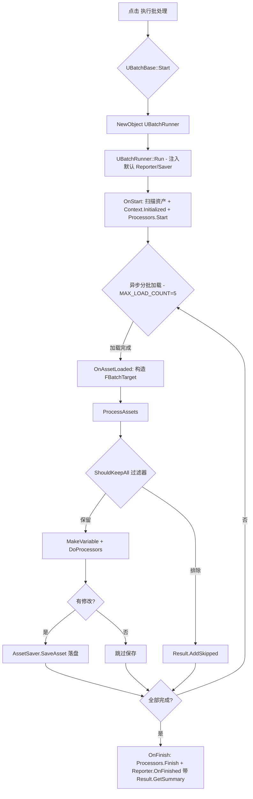

# BatchProcessor - 资产批处理工具

## 目录

- [插件概览](#插件概览)
- [核心概念与架构](#核心概念与架构)
- [执行流程](#执行流程)
- [内置组件清单](#内置组件清单)
- [快速开始](#快速开始)
- [编辑器集成](#编辑器集成)
- [扩展开发指南](#扩展开发指南)
- [试运行（Dry-run）](#试运行dry-run)
- [常见问题](#常见问题)

## 插件概览

BatchProcessor 是一个专为 **Unreal Engine 编辑器** 编写的资产批处理插件。通过组合扫描器（Scanner）、过滤器（Filter）、处理器（Processor）和条件（Condition），你可以在保留可视化体验的同时定制复杂的资产批处理规则。

插件采用 **配置 / 编排 / 服务 / 组件 / 内核** 五层分层架构：配置层（`UBatchBase` CDO 纯数据）→ 编排层（`UBatchRunner` 运行实例）→ 服务层（接口注入的进度反馈与资产保存）→ 组件层（四大可组合组件）→ 内核层（反射读写引擎）。运行态全部承载于 `UBatchRunner`，CDO 仅作不可变配置模板，支持安全的重入与回调保活。

> **目标场景**：批量修改资产默认值、统一资源引用、批量生成辅助数据、批量执行校验等。支持蓝图（Blueprint）、数据资产（DataAsset）、材质（Material）等任意 UObject 派生类型。

## 核心概念与架构

### 顶层对象

- **`UBatchBase`**：批处理任务蓝图的父类，**仅作为配置模板**（CDO 纯数据）。持有 `Scanners / Filters / Processors` 内联实例配置与 `bDryRun` 开关。`Start()` 创建运行实例，自身不承载任何运行态。
- **`UBatchRunner`**：单次批处理的**运行实例**（由 `UBatchBase::Start` 通过 `NewObject` 创建）。承载状态机（`EBatchStatus`）、异步加载器（`FStreamableManager`）、上下文（`UBatchContext`），编排 `OnStart → OnProcessing → OnAssetLoaded → ProcessAssets → OnFinish` 全流程。
- **`UBatchContext`**：在一次批处理中共享的上下文，保存待处理资产集合、异步加载状态、统计信息、ScratchPad 映射以及**批处理结果**（`FBatchResult`）。
- **`FBatchTarget`**：统一抽象「被批处理的对象」。可能是 `UBlueprint`（变量根 = `GeneratedClass` 的 CDO），也可能是 DataAsset / Material 等普通资产（变量根 = 资产自身）。组件链统一面向 `FBatchTarget`，不再硬编码 `UBlueprint`。
- **`FBatchResult`**：批处理结果聚合，记录已处理数 / 修改数 / 跳过数 / 失败数 / 被处理资产路径列表，供统计器与进度反馈在结束时读取。
- **`UBatchScratchPad` / `IBatchScratchPadInterface`**：供处理器跨资产缓存临时状态（按 UID 在 `UBatchContext` 中懒创建并缓存）。

### 服务接口（依赖注入）

UI 与 IO 通过纯 C++ 抽象接口解耦，可在编辑器与 CI 间切换：

- **`IBatchProgressReporter`**：进度反馈接口（`OnBegin / OnProgress / OnFinished`）。
  - `FSlateBatchProgressReporter`：编辑器 Slate 通知（进度条）。
  - `FNullBatchProgressReporter`：CI / 命令行空实现。
- **`IBatchAssetSaver`**：资产保存接口（`SaveAsset` → `EBatchSaveResult`）。
  - `FDefaultBatchAssetSaver`：标脏 → 关闭编辑器 → `SavePackage` 落盘。
  - `FDryRunBatchAssetSaver`：试运行，仅记录不落盘。

未注入时 `UBatchRunner::Run` 默认使用 Slate + Default 实现（保持编辑器交互行为）。

### 模块化组件

所有组件均为 `UCLASS(Abstract, EditInlineNew)`，在 `UBatchBase` 中以 `Instanced TArray` 内联实例化配置。

- **`UScannerBase`**
  - `ScannerAssets` → `OnScannerAssets` 收集 `FAssetData`，随后 `OnFilter` 根据正则表达式与名称类型（`EFilter_NameType`）做初筛。
- **`UFilterBase`**
  - `ShouldKeep` → `OnShouldKeep`，返回 `true` 表示**保留**该资产，`false` 表示排除。基类提供 `bInvert` 翻转选项。
  - `UBatchFunctionLibrary::ShouldKeepAll` 聚合所有过滤器：全部返回 `true` 才保留。
- **`UProcessorBase`**
  - `Start / Processing / Finish` 对应生命周期，`OnProcessing` 中实现逻辑。返回 `true` 表示资产被修改以触发保存。
  - 可通过 `GetSubProcessors` 组合子处理器，或使用 `UBatchFunctionLibrary::DoProcessors` 顺序执行数组。
  - 实现 `IBatchScratchPadInterface`，可申请按 UID 缓存的便笺簿。
- **`UConditionBase`**
  - `CheckCondition` 决定条件是否通过，带 `bNegation`（取反）选项。常和 `UProcessor_Condition` 配合控制流程。

### 数据结构

- **`FBatchTarget`**：封装被处理资产，提供 `GetAsset / GetBlueprint / GetGeneratedClass / GetVariableObject / GetSaveObject / MakeVariable / GetName / GetPathName` 等访问器。
- **`FBatchVariable`**：封装任意对象或属性的地址 / 结构体，传递给处理器 / 条件用于读写。
- **`FBatchProperty`**：描述某个 `FProperty` 的内存地址，通常由 `UBatchFunctionLibrary::FindProperty` 返回。
- **`FBatchResult`**：批处理结果聚合（`bModified / ProcessedCount / ModifiedCount / SkippedCount / FailedCount / TouchedAssets`）。

## 执行流程


```mermaid
graph TD
    A[点击 执行批处理] --> B{UBatchBase::Start}
    B --> C[NewObject UBatchRunner]
    C --> D[UBatchRunner::Run - 注入默认 Reporter/Saver]
    D --> E[OnStart: 扫描资产 + Context.Initialized + Processors.Start]
    E --> F{异步分批加载 - MAX_LOAD_COUNT=5}
    F -->|加载完成| G[OnAssetLoaded: 构造 FBatchTarget]
    G --> H[ProcessAssets]
    H --> I{ShouldKeepAll 过滤器}
    I -->|保留| J[MakeVariable + DoProcessors]
    J --> K{有修改?}
    K -->|是| L[AssetSaver.SaveAsset 落盘]
    K -->|否| M[跳过保存]
    I -->|排除| N[Result.AddSkipped]
    L --> O{全部完成?}
    M --> O
    N --> O
    O -->|否| F
    O -->|是| P[OnFinish: Processors.Finish + Reporter.OnFinished 带 Result.GetSummary]
```

- 进度通过注入的 `IBatchProgressReporter` 实时展示（默认 Slate 通知）。
- 资产保存通过注入的 `IBatchAssetSaver` 完成（默认标脏 + 关闭编辑器 + `SavePackage`）。
- 结束消息带结果摘要：`"批处理完成: 处理 N | 修改 M | 跳过 K | 失败 L"`。

## 内置组件清单

| 类型 | 类名 | 功能要点 |
| --- | --- | --- |
| Scanner | `UScanner_Directory` | 扫描指定目录，支持递归，按资产类（`TSubclassOf<UObject>`）过滤 |
| Filter | `UFilter_GeneratedClass` | 根据生成类类型过滤，支持 `bInvert` 取反 |
| Processor | `UProcessor_Condition` | 条件分支执行（Conditions + Processors） |
| Processor | `UProcessor_Iterators` | 对数组 / 集合 / 映射执行迭代 |
| Processor | `UProcessor_Usage` | 资产统计器，从 `FBatchResult` 读取并弹窗汇总 |
| Processor | `UProcessorBlueprintBase` | 蓝图可继承的处理器基类（BP 事件转发） |
| ProcessorProperty | `UProcessorProperty_Bool/Int/Float/String/Material` | 修改对应类型属性 |
| ProcessorProperty | `UProcessorProperty_Object` | 修改 `UObject` 硬引用属性 |
| ProcessorProperty | `UProcessorProperty_SoftObject` | 修改 `FSoftObjectPath` 软引用属性 |
| Condition | `UConditionProperty_Bool/Class/Int/Float/String` | 针对属性判定 |
| Condition | `UConditionPropertyContainer_Bool/Int/Float/String` | 针对容器（Array/Set/Map）属性判定 |

## 快速开始

### 1. 创建批处理蓝图

1. 在内容浏览器新建蓝图类，父类选 `BatchBase`。
2. 进入 **Class Defaults**，在 `Scanners / Filters / Processors` 中添加需要的实例并配置参数。

### 2. 配置示例

```text
Scanners:
  - Scanner_Directory: Directory=/Game/MyAssets, AssetClass=BP_BaseActor, bRecursivePaths=true
Filters:
  - Filter_GeneratedClass: ComparisonOperator=Child, GeneratedClass=BP_BaseActor_C
Processors:
  - Processor_Condition
      Conditions: [ConditionProperty_Bool(ComparisonOperator=Equal, Value=true)]
      bMustPassAllCondition: true
      Processors: [ProcessorProperty_Bool(PropertyName="bReplicates", Value=true)]
```

### 3. 运行与监控

1. 保持批处理蓝图编辑器打开。
2. 工具栏中点击 **执行批处理**（Play 图标）。
3. 在右下角通知面板查看进度与当前资产。
4. 可随时点击 **终止批处理**（Stop 图标）停止任务。
5. 结束时通知显示结果摘要（处理 / 修改 / 跳过 / 失败）。

## 编辑器集成

`FBatchProcessorModule` 在启动时注册蓝图编辑器工具栏扩展：

- `ExecuteBatchProcessing`：调用 `UBatchBase::Start()`。
- `TerminationBatchProcessing`：调用 `UBatchBase::Stop()`。

按钮仅在当前蓝图的 `GeneratedClass` 继承自 `UBatchBase` 时显示。

## 扩展开发指南

### 过滤时机：pre-load vs post-load

| 阶段 | 写在哪里 | 可用数据 | 典型用途 |
|---|---|---|---|
| **pre-load**（加载前） | `UScannerBase::OnScannerAssets` 或调用 `FilterAssetsByName` | `FAssetData`（路径、类名、标签，无资产内容） | 按目录、资产类、名称正则筛选，尽早剪枝减少加载量 |
| **post-load**（加载后） | `UFilterBase::OnShouldKeep` | 已加载的 `FBatchTarget`（可读取 CDO 属性、材质参数等） | 按资产内容条件精细过滤，如属性值、引用关系 |

> **原则**：能在 pre-load 阶段判断的条件尽量写在 Scanner（`FilterAssetsByName` 工具方法可复用），减少不必要的异步加载。运行时内容条件才放 Filter。

1. **自定义扫描器**
   - 继承 `UScannerBase`，重写 `OnScannerAssets` 收集资产，可复用 `OnFilter` 的正则过滤。
   - 若需在自定义 Scanner 内做额外名称过滤，可直接调用静态方法 `UScannerBase::FilterAssetsByName(Assets, NameType, Regex)`。
2. **自定义过滤器**
   - 继承 `UFilterBase`，重写 `OnShouldKeep` 返回是否**保留**该资产。基类已处理 `bInvert` 翻转，子类只需返回「是否匹配保留条件」。
   - 签名：`virtual bool OnShouldKeep(const FBatchTarget& Target) const;`
3. **自定义处理器**
   - 继承 `UProcessorBase`，重写 `OnProcessing` 并使用 `UBatchFunctionLibrary::FindProperty / SetProperty` 操作属性。
   - 签名：`virtual bool OnProcessing(const FBatchTarget& Target, UBatchContext* Context, const FBatchVariable& Variable) const;`
   - 如需跨资产共享数据，实现 `IBatchScratchPadInterface` 并在 `Context->GetScratchPad<T>(this)` 中取得自定义 ScratchPad。
4. **条件扩展**
   - 继承 `UConditionBase`，重写 `OnCheckCondition` 封装布尔判断。基类已处理 `bNegation` 取反。
   - 签名：`virtual bool OnCheckCondition(const FBatchTarget& Target, UBatchContext* Context, const FBatchVariable& Variable);`
5. **进度反馈 / 保存策略自定义**
   - 实现 `IBatchProgressReporter` 或 `IBatchAssetSaver`，通过 `UBatchRunner::SetProgressReporter / SetAssetSaver` 注入。

建议在 C++ 中实现核心逻辑，蓝图中组合参数，以保持性能与可视化并存。

## 试运行（Dry-run）

`UBatchBase` 提供 `bDryRun`（DisplayName「试运行(不保存)」）选项。启用后：

- `UBatchBase::Start` 注入 `FDryRunBatchAssetSaver`，处理器照常执行并返回修改结果，但**不会标脏、不会关闭编辑器、不会落盘**。
- 仅在日志中记录「Would Save [资产名]」，用于预检批处理规则的影响范围。
- `FBatchResult` 仍正常统计 ProcessedCount / ModifiedCount，可用于评估。

## 常见问题

- **如何只处理部分资产？**
  - 使用 `UScanner_Directory` 指定路径与 `AssetClass`，并在 `RegularExpressions` 中写入正则表达式过滤资产 / 包名。
- **资产未保存怎么办？**
  - 检查 `UProcessorBase::OnProcessing` 是否返回 `true`，只有返回 `true` 时 `UBatchRunner` 才会调用 `AssetSaver->SaveAsset`。
  - 若启用了 `bDryRun`，资产不会落盘（仅记录），关闭该选项即可。
- **过滤器语义是怎样的？**
  - `ShouldKeep` 返回 `true` = **保留**资产，`false` = 排除。`OnShouldKeep` 返回「是否匹配保留条件」，基类用 `bInvert` 翻转。所有过滤器的 `ShouldKeep` 都返回 `true` 时资产才保留。
  - **安全默认**：`UFilter_GeneratedClass` 若 `GeneratedClass` 未配置或尚未加载，会无论 `bInvert` 取何值都**排除全部资产**并输出 Warning，防止漏配静默放行。`UConditionProperty_Class` 同理。
- **支持哪些资产类型？**
  - 任意 `UObject` 派生类型。蓝图变量根取 `GeneratedClass` 的 CDO；其它资产（DataAsset / Material 等）变量根取资产自身。
- **容器条件 Include / Included / Equal 的语义是什么？**
  - `Include`（包含目标）：配置的 `Values` 集合（含重复）是属性容器的**子多重集**。即 `Values=[1,1]` 要求容器中至少有两个 `1`。
  - `Included`（被目标包含）：属性容器是配置的 `Values` 集合的**子多重集**。
  - `Equal`（等于）：两者为相同多重集（元素与数量完全一致）。由于 `TSet / TMap` 迭代顺序不确定，比较前会对双方排序，结果稳定。
- **如何在 CI / 命令行中运行？**
  - 注入 `FNullBatchProgressReporter`（无 UI）与自定义 `IBatchAssetSaver`（如接入源码管理 checkout），即可在无编辑器交互的环境下运行。

---

如需了解更多 API 细节，请参考 `Source/BatchProcessor/Public` 目录中的头文件。
